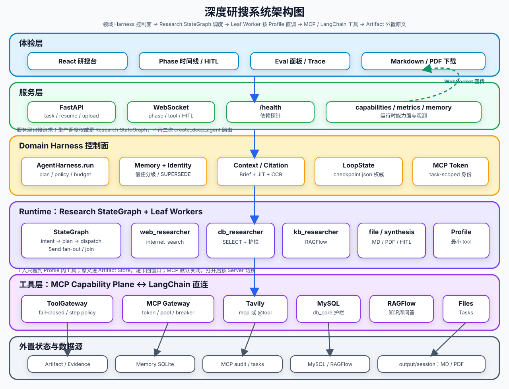

<div align='center'>
  <h1 style="margin-top: 15px;">「深度研搜」对话式多智能体研究系统</h1>
  <h4><b>deepsearch-agents</b></h4>
  <p><em>DeepAgents 多智能体深度研搜 + 自研 Agent Harness 运行时层 — 可见、可测、可控，适合 2026 年 Agent / Harness 工程师面试展示</em></p>
</div>

<div align='center'>


[](https://didilili.github.io/ai-agents-from-zero/#/%E5%AE%9E%E6%88%98%E9%A1%B9%E7%9B%AE-%E6%B7%B1%E5%BA%A6%E7%A0%94%E6%90%9C/0-%E5%89%8D%E8%A8%80)
[](.github/workflows/eval-regression.yml)

</div>

**📢 说明**：本仓库在 2026 年 5 月教学版基础上，已完成 **Agent Harness 企业级升级（v1.0-harness）**，配套设计文档 [`docs/AGENT_HARNESS_DESIGN.md`](docs/AGENT_HARNESS_DESIGN.md)、[BrowseComp-Plus 固定语料评测指南](docs/BROWSECOMP_PLUS_EVAL.md)、golden task 评测与 GitHub Actions 回归门禁。

如果你正在找一个适合学习 `DeepAgents`、`WebSocket`、`Tavily`、`RAGFlow` 和 AI Agent 工程开发的实战项目，「深度研搜」很可能是最适合你的项目。

它不是只调用一次大模型接口，也不是套一个搜索 API 做问答演示。这个项目围绕深度研究场景，用 DeepAgents 组织主智能体和专家子智能体，让系统可以根据任务需要查公开网络、查结构化数据库、查 RAGFlow 私有知识库、读取用户上传附件，并把最终结果整理成回答、Markdown 或 PDF。换句话说，你学到的不是某一个框架 API，而是一条 AI 应用从多智能体规划、工具接入、上下文隔离、接口交付到前端联调的完整项目主线。

> 本套仓库是 [ai-agents-from-zero](https://github.com/didilili/ai-agents-from-zero) 教程体系中的 [实战项目-深度研搜](https://github.com/didilili/ai-agents-from-zero/tree/main/%E5%AE%9E%E6%88%98%E9%A1%B9%E7%9B%AE-%E6%B7%B1%E5%BA%A6%E7%A0%94%E6%90%9C) 配套源码仓库，除了可直接运行和二次开发的项目代码之外，也提供了与教程章节对应的 Git 分支演进过程，以及完整的在线图文讲义入口。
> 如果你想系统学习「AI 智能体 大模型应用开发」，也可直接从系统教程 [AI 智能体实战速成指南-大模型入门](https://didilili.github.io/ai-agents-from-zero/#/) 开始。


## 🎯 Agent Harness 企业级升级（面试版）

> **定位**：在 DeepAgents/LangGraph 之上自研 Harness 运行时层，把隐式 Agent Loop **显式化**为可见、可测、可控的工程系统。

### 面试一句话

> 在深度研搜场景下，我实现了 per-step Harness Loop（understand → plan → execute → compress → validate → recover → finalize），接入 MCP 工具注册、跨会话记忆、Langfuse/JSONL 观测和 golden task 评测；当前是 **可演示 MVP+**，生产侧清楚还缺 HITL、Redis Checkpointer 和全量 MCP Server 集群。

### Harness 五层架构

```text
Layer 5  体验层     React — Phase 时间线 / 文件下载
Layer 4  服务层     FastAPI — 任务调度 / WebSocket / GET /health
Layer 3  Harness层  loop / validator / recovery / compressor / context_builder  ← 核心自研
Layer 2  Runtime层  DeepAgents + LangGraph + InMemorySaver
Layer 1  工具层     MCP Registry + Tavily MCP Server(stdio) + MySQL + RAGFlow + Memory
```

### 核心能力矩阵

| 能力 | 实现 | 关键路径 |
|------|------|----------|
| 显式 Loop | per-step execute/compress/validate/recover | `app/agent/harness/loop.py` |
| 结果校验 | step + finalize 双层校验 | `app/agent/harness/validator.py` |
| 失败恢复 | 结构化 hint + 重试上限 | `app/agent/harness/recovery.py` |
| 上下文压缩 | LLM 摘要 + 截断降级 | `app/agent/harness/compressor.py` |
| 跨会话记忆 | 分层 Memory：身份四元组 + 信任分级 + 来源台账 + SUPERSEDE | `app/agent/memory/` `docs/MEMORY_ARCHITECTURE.md` |
| MCP 工具发现 | Registry + **真 stdio MCP Server（Tavily）** | `app/mcp/` |
| 可观测性 | WebSocket + Langfuse + JSONL 日志 | `app/api/monitor.py` `tracing.py` `trace_logger.py` |
| 评测回归 | 10 条 golden task + 8 项指标 + baseline | `tests/eval/` + CI |
| 配置化 | `harness.yml` 统一开关 | `app/config/harness.yml` |
| 健康检查 | `GET /health` 依赖探针 | `app/api/health.py` |

### 执行数据流（升级后）

```text
用户任务 → FastAPI(thread_id)
  → AgentHarness.run()
      → understand → plan → build_context(memory recall)
      → for each step: execute → compress → validate
          → fail → recover → retry
      → finalize(memory remember) → JSONL trace
  → WebSocket 推送 phase 事件 → 前端时间线
```

### 快速验证（面试 Demo）

```bash
# 1. 单元测试（无需 API Key）
uv run python tests/test_harness_phase1.py
uv run python tests/test_harness_phase4.py
uv run python tests/test_mcp_tavily_server.py

# 2. Eval 评测 + 基线对比
uv run python tests/eval/run_eval.py --dry-run --baseline tests/eval/results/baseline.json --report-md

# 3. Live 评测（需 .env 配置 LLM/Tavily）
uv run python tests/eval/run_eval.py --live --limit 3 --report-md

# 4. 健康检查
uv run uvicorn app.api.server:app --reload
curl http://localhost:8000/health

# 5. 真 MCP Tavily Server（stdio，需 TAVILY_API_KEY）
# 在 harness.yml 设 mcp.tavily_enabled: true 或 .env 设 HARNESS_MCP_TAVILY=true
uv run python -m app.mcp.servers.tavily_server
```

### Eval 指标（8 项）

| 指标 | 含义 | 目标 |
|------|------|------|
| TSR | 任务成功率 | ≥ 70% |
| TSA | 工具/子 Agent 选择准确率 | ≥ 80% |
| SSR | 各 step 校验通过率 | ≥ 85% |
| RR | 失败后恢复成功率 | ≥ 60% |
| ATC | 平均工具调用次数 | ≤ 8 |
| AL | 端到端延迟 | ≤ 120s |
| CR | 压缩率 | ≤ 30% |
| MRH | 跨会话记忆召回命中 | ≥ 80% |

CI 在每次 push/PR 时自动跑 dry-run eval，**TSR 下降 > 5% 则阻断合并**（见 [`.github/workflows/eval-regression.yml`](.github/workflows/eval-regression.yml)）。

### 面试必须能演示的 5 件事

1. 完整链路：搜索 + DB + 生成 PDF
2. 前端 Phase 时间线（含 Step 1/3）
3. **HITL 审批**：数据库步骤 gate 或 `generate_markdown` interrupt_on 弹窗
4. Eval 跑分报告（侧边栏 **Eval 面板**）
5. Trace 查看器（JSONL + Langfuse 外链）

### 生产特性（Phase 5 + Phase 6）

| 特性 | 入口 | 说明 |
|------|------|------|
| HITL `interrupt_on` | 对话页审批卡片 | `generate_markdown` / `convert_md_to_pdf` 执行前暂停 |
| Step Gate | 同上 | `database_query` 步骤执行前人工确认 |
| **Plan Review + Edit** | 同上 | 多意图任务计划审批，支持 JSON 编辑步骤（Phase 6） |
| **Dynamic Re-plan** | Harness Loop | 失败/用户编辑后动态插入步骤（Phase 6） |
| **Citation-First** | finalize + Trace | 证据链 `evidence.json`、参考文献块、CCR/HR 指标 |
| **Trajectory Diff Eval** | Eval 面板 | TDS 轨迹相似度 + golden `expected_trajectory` |
| Resume API | `POST /api/task/{thread_id}/resume` | `{decisions:[{type:"approve"\|"edit"\|"reject"}]}` |
| Eval 面板 | 侧边栏 → Eval 面板 | `GET /api/eval/latest` + 一键 dry-run |
| Trace 查看器 | 侧边栏 → Trace 查看器 | JSONL / **证据链** / Langfuse |

```bash
# HITL 演示任务
从数据库查询心血管药品库存，生成 Markdown 报告   # 先弹 step gate
搜索 AI 趋势并生成 Markdown 报告                 # 命中 generate_markdown interrupt_on
```

---

## 📖 项目介绍

在真实研究场景里，用户的问题经常不是一句普通问答可以解决的。

比如：

```text
结合公开资料、数据库信息和我上传的文档，整理一份机器人行业研究报告，并生成 PDF。
```

这个任务背后可能包含多类动作：

- 判断需要公开资料、内部数据、私有知识库还是本次上传文件；
- 去互联网搜索最新新闻、政策、产品或行业资料；
- 到 MySQL 查询企业结构化业务数据；
- 到 RAGFlow 查询内部非结构化文档；
- 读取用户上传的 PDF、Word、Excel、Markdown 或文本文件；
- 汇总多来源信息，判断资料是否足够；
- 生成 Markdown 报告，并在需要时转换成 PDF；
- 把执行过程、最终结果和生成文件实时展示给前端。

所以「深度研搜」更像一个会分工、会查资料、会生成交付物的研究助手。用户只需要提出任务，系统会在后端组织一条可观察的多智能体执行链路。

```text
用户任务
  -> FastAPI 接口接收请求
  -> AgentHarness.run() 显式 Loop
  -> understand / plan / per-step execute / validate / recover
  -> 分派给网络搜索助手 / 数据库查询助手 / RAGFlow 助手
  -> MCP Registry 按 step 注入工具上下文
  -> 调用文件工具生成 Markdown / PDF
  -> monitor + JSONL + Langfuse 记录全链路
  -> 前端展示 Phase 时间线、答案和文件列表
```

## ✨ 项目亮点

- **自研 Agent Harness 运行时层（2026 面试核心）**
  - 显式 per-step Loop：execute → compress → validate → recover，非黑盒 `astream`。
  - `harness.yml` 配置化 + budget 守卫 + JSONL 结构化日志 + `GET /health`。
- **一主三从的多智能体架构**
  - 主智能体负责理解任务、规划步骤、调度助手和最终汇总。
  - 网络搜索助手、数据库查询助手、RAGFlow 助手分别处理不同信息来源。
- **多来源检索，而不是模型裸答**
  - `Tavily` 负责互联网公开资料检索。
  - `MySQL` 负责查询结构化业务数据。
  - `RAGFlow` 负责查询内部非结构化文档。
  - 上传附件由主智能体通过文件工具读取。
- **从检索到交付的完整可运行链路**
  - 不停留在 Prompt 设计，而是会真实调用工具、读取数据、生成 Markdown，并在需要时转换成 PDF。
- **长任务执行过程可观察**
  - 工具调用、子智能体调用、工作目录创建、任务结果、取消和异常都会通过 `monitor` 推送到前端。
- **会话级上下文隔离**
  - 通过 `thread_id` 和 `session_dir` 区分不同任务，`ContextVar` 让深层工具也能拿到当前会话身份和文件目录。
- **工程化前后端结构清晰**
  - 基于 `FastAPI + WebSocket + DeepAgents + React` 组织任务接口、异步执行、事件推送、文件上传和文件下载。
- **Golden Task 评测 + CI 回归门禁**
  - 10 条评测任务、8 项指标、baseline 对比；GitHub Actions 自动跑分。
- **真 MCP Server（Tavily stdio）**
  - `app/mcp/servers/tavily_server.py` 通过 MCP 协议暴露搜索工具，Registry 可按 step 发现。
- **不仅有实战代码，还有完整配套教程文档**
  - 项目配有一套系统化、完全免费的教程讲义，适合按章节从 DeepAgents 基础、子智能体、Backend、中间件一直学到完整项目闭环。
- **兼顾学习价值与可扩展性**
  - 既可以按教程章节逐步理解，也可以在此基础上继续扩展权限控制、任务队列、事件持久化、评测体系等能力。

这套课程十分适合这些场景：

- 想系统学习 `DeepAgents`，但不想只停留在几个玩具示例。
- 想把 `Tavily`、`MySQL`、`RAGFlow` 和大模型放到同一个研究助手场景里理解。
- 想做一个比简单模型调用更接近真实开发的 AI Agent 项目。
- 想把项目写进简历，并且能说清楚智能体层、工具层、服务层、文件层和前端层分别做了什么。

## 🏗️ 系统架构



项目采用 DeepAgents 中典型的 Orchestrator-Workers 模式：主智能体作为调度中心，三个专家助手负责信息获取，文件工具由主智能体直接掌握。

项目围绕两条主线展开：

| 主线             | 做什么                                                       | 涉及模块                                                                  |
| ---------------- | ------------------------------------------------------------ | ------------------------------------------------------------------------- |
| 多智能体深度研搜 | 基于用户任务完成规划、分派、检索、读取附件、汇总和生成交付物 | `DeepAgents` / `LangChain` / `LangGraph` / `Tavily` / `MySQL` / `RAGFlow` |
| 前后端实时闭环   | 启动后台任务、上传文件、推送执行过程、展示结果和下载生成文件 | `FastAPI` / `WebSocket` / `React` / `Vite`                                |

### 智能体与工具

| 归属           | 能力                                     | 工具                                                          |
| -------------- | ---------------------------------------- | ------------------------------------------------------------- |
| 主智能体       | 任务规划、助手调度、结果汇总、文件交付   | `read_file_content`、`generate_markdown`、`convert_md_to_pdf` |
| 网络搜索助手   | 查询互联网公开信息、新闻、政策和网页资料 | `internet_search`                                             |
| 数据库查询助手 | 发现表名、预览表结构和样例数据、执行 SQL | `list_sql_tables`、`get_table_data`、`execute_sql_query`      |
| RAGFlow 助手   | 发现可用知识库助手，并向内部知识库提问   | `get_assistant_list`、`create_ask_delete`                     |


## 🛠️ 项目技术栈

| 模块           | 技术                                             | 作用                                                                          |
| -------------- | ------------------------------------------------ | ----------------------------------------------------------------------------- |
| 智能体框架     | `DeepAgents`                                     | 创建主智能体和子智能体，承接长任务、多工具、多助手调度                        |
| 图与检查点     | `LangGraph`                                      | 提供底层运行时和 `InMemorySaver` 会话检查点                                   |
| 模型与工具抽象 | `LangChain` / `langchain-core`                   | 封装 OpenAI 兼容模型、工具声明和 Agent 调用结构                               |
| 大模型接入     | OpenAI 兼容接口                                  | 通过 `.env` 中的 `OPENAI_BASE_URL`、`OPENAI_API_KEY`、`LLM_QWEN_MAX` 接入模型 |
| 网络搜索       | `Tavily`                                         | 为网络搜索助手提供公开资料检索                                                |
| 结构化数据     | `MySQL` / `mysql-connector-python`               | 为数据库助手提供药品、库存、销售等教学业务数据                                |
| 私有知识库     | `RAGFlow` / `ragflow-sdk`                        | 为知识库助手提供内部文档问答能力                                              |
| 文件处理       | `pypdf` / `python-docx` / `pandas` / `ReportLab` | 读取上传附件，生成 Markdown，转换 PDF                                         |
| 后端接口       | `FastAPI` / `Uvicorn`                            | 提供任务、取消、上传、文件列表、下载和 WebSocket 接口                         |
| 实时通信       | `WebSocket`                                      | 推送工具调用、助手调用、Harness Phase 事件和最终结果 |
| 可观测性       | `Langfuse` + JSONL                               | 可选 Langfuse trace + 每次 run 写 `logs/traces/*.jsonl` |
| MCP            | `mcp` SDK + stdio                                | Tavily 真 MCP Server；Registry 按 step 发现工具 |
| Harness 配置   | `harness.yml`                                    | max_retries / 压缩 / 记忆 / 观测 / budget / MCP 开关 |
| 评测           | `tests/eval/`                                    | golden task + 8 指标 + baseline 回归 |
| 前端           | `React` / `Vite` / `Ant Design` / `Tailwind CSS` | 对话式研搜界面、Harness Phase 时间线、附件上传和文件下载 |
| 依赖管理       | `uv` / `pnpm`                                    | 管理 Python 后端和前端依赖                                                    |

## 📁 项目结构

```text
deepsearch-agents/
├── app/
│   ├── agent/
│   │   ├── harness/                # 【核心】Agent Harness：loop/validator/recovery/compressor
│   │   ├── memory/                 # 跨会话记忆 store + extractor
│   │   ├── subagents/              # 网络搜索、数据库查询、RAGFlow 三个子智能体
│   │   ├── llm.py
│   │   ├── main_agent.py           # 委托 AgentHarness.run()
│   │   └── prompts.py
│   ├── api/
│   │   ├── context.py
│   │   ├── monitor.py              # WebSocket 事件 + report_phase()
│   │   ├── tracing.py              # Langfuse（可选）
│   │   ├── trace_logger.py         # JSONL 结构化日志
│   │   ├── health.py               # GET /health 依赖探针
│   │   └── server.py
│   ├── config/
│   │   └── harness.yml             # Harness 统一配置
│   ├── mcp/
│   │   ├── registry.py             # MCP 工具注册表
│   │   ├── client.py               # bootstrap + MCP 桥接
│   │   ├── mcp_runtime.py          # stdio MCP Client
│   │   └── servers/
│   │       └── tavily_server.py    # 真 MCP Server（Tavily）
│   ├── prompt/
│   ├── ragflow/
│   ├── tools/
│   ├── utils/
│   ├── logs/traces/                # 运行时：JSONL trace（gitignore）
│   ├── output/
│   └── updated/
├── .github/workflows/
│   └── eval-regression.yml         # CI：dry-run eval + TSR 回归门禁
├── docker/
├── docs/
│   └── AGENT_HARNESS_DESIGN.md     # Harness 设计文档 v1.0
├── tests/
│   ├── eval/                       # golden task + metrics + run_eval
│   ├── test_harness_phase1.py
│   ├── test_harness_phase4.py
│   └── test_mcp_tavily_server.py
├── frontend/
├── .env.example
├── pyproject.toml
└── requirements.txt
```

## 🚀 快速开始

### 1. 准备环境

- Python `3.12`
- `uv`
- Docker 与 Docker Compose
- Node.js 与 `pnpm`
- 可用的大模型 API Key
- Tavily API Key
- RAGFlow 服务与 API Key

### 2. 克隆项目

```bash
git clone https://github.com/didilili/deepsearch-agents.git
cd deepsearch-agents
```

### 3. 安装后端依赖

```bash
uv sync
```

### 4. 配置环境变量

```bash
cp .env.example .env
```

按本机实际服务和密钥修改 `.env`：

```bash
# LLM 配置
OPENAI_BASE_URL=https://dashscope.aliyuncs.com/compatible-mode/v1
OPENAI_API_KEY=你的大模型_API_KEY
LLM_QWEN_MAX=qwen-max

# Tavily 配置
TAVILY_API_KEY=你的_TAVILY_API_KEY

# RAGFlow 配置
RAGFLOW_API_URL=http://your-ragflow-host
RAGFLOW_API_KEY=ragflow-your-api-key

# MySQL 配置
MYSQL_USER=root
MYSQL_PASSWORD=root
MYSQL_DATABASE=deepsearch_db
MYSQL_HOST=localhost
MYSQL_PORT=3307
MYSQL_CHARSET=utf8mb4
MYSQL_COLLATION=utf8mb4_unicode_ci
MYSQL_SQL_MODE=TRADITIONAL
```

### 5. 启动 MySQL 教学库

本仓库的 `docker/mysql/mysql.sql` 会在 MySQL 容器首次创建数据目录时自动导入药品、库存和销售记录模拟数据。

```bash
docker compose -f docker/docker-compose.yaml up -d
```

### 6. 准备 RAGFlow 知识库

RAGFlow 不在本仓库的 Docker Compose 中启动，需要接入你已有的 RAGFlow 服务，或按配套教程部署。仓库内的 `docs/knowledge_base/` 提供了电商、金融等示例 PDF，可用于创建 RAGFlow 知识库和聊天助手。

如果暂时不使用私有知识库能力，也可以先跑网络搜索、数据库查询和上传文件读取链路；只有任务触发 RAGFlow 助手时才会依赖 `RAGFLOW_API_URL` 和 `RAGFLOW_API_KEY`。

### 7. 启动后端

```bash
uv run uvicorn app.api.server:app --host 0.0.0.0 --port 8000 --reload
```

后端默认接口：

| 接口                                | 说明                                   |
| ----------------------------------- | -------------------------------------- |
| `POST /api/task`                    | 启动一次 DeepAgents 后台任务           |
| `POST /api/task/{thread_id}/cancel` | 取消指定会话任务                       |
| `POST /api/upload`                  | 上传一个或多个文件到当前会话           |
| `GET /api/files`                    | 列出当前会话输出目录中的生成文件       |
| `GET /api/download`                 | 下载输出目录中的文件                   |
| `POST /api/task/{thread_id}/resume` | HITL 人工审批恢复（approve/reject/edit） |
| `GET /api/task/{thread_id}/hitl/pending` | 查询待审批动作 |
| `GET /api/eval/latest` | Eval 面板：最新评测报告 |
| `POST /api/eval/run` | 触发 dry-run / live eval |
| `GET /api/traces/jsonl/{session_id}` | Trace 查看器：本地 JSONL |
| `GET /api/traces/langfuse/{session_id}` | Trace 查看器：Langfuse 代理 |
| `WebSocket /ws/{thread_id}`         | 推送工具调用、助手调用、Phase 事件和结果 |

### 8. 启动前端

```bash
cd frontend
pnpm install
pnpm dev
```

前端默认连接：

```text
API: http://localhost:8000
WS:  ws://localhost:8000
```

如需修改，可以在 `frontend/.env.local` 中配置：

```bash
VITE_API_BASE_URL=http://localhost:8000
VITE_WS_BASE_URL=ws://localhost:8000
```

### 9. 试几个任务

```text
从数据库中查询心血管药品的库存情况，并生成 Markdown 报告。
```

```text
搜索 2026 年 AI 在电商行业的应用趋势，并结合知识库资料生成一份 PDF。
```

```text
请先读取我上传的行业报告，再结合公开资料整理一份研究摘要。
```

## 📚 配套教程目录

教程总入口：[深度研搜完整教程](https://didilili.github.io/ai-agents-from-zero/#/%E5%AE%9E%E6%88%98%E9%A1%B9%E7%9B%AE-%E6%B7%B1%E5%BA%A6%E7%A0%94%E6%90%9C/0-%E5%89%8D%E8%A8%80)

| 章节 | 标题                                                                                                                                   | 学习重点                                                      | 对应分支                              |
| ---- | -------------------------------------------------------------------------------------------------------------------------------------- | ------------------------------------------------------------- | ------------------------------------- |
| 0    | [前言](https://didilili.github.io/ai-agents-from-zero/#/实战项目-深度研搜/0-前言)                                                      | 项目定位、学习价值、技术栈和能力边界                          | `-`                                   |
| 1    | [DeepAgents 基础与核心概念](https://didilili.github.io/ai-agents-from-zero/#/实战项目-深度研搜/1-DeepAgents基础与核心概念)             | 智能体演进、框架定位、核心能力和多智能体设计边界              | `-`                                   |
| 2    | [DeepAgents 快速入门与流式解析](https://didilili.github.io/ai-agents-from-zero/#/实战项目-深度研搜/2-DeepAgents快速入门与流式解析)     | `create_deep_agent()`、`invoke`、`stream`、`chunk`            | `02-quickstart-streaming`             |
| 3    | [子智能体进阶与异步执行](https://didilili.github.io/ai-agents-from-zero/#/实战项目-深度研搜/3-子智能体进阶与异步执行)                  | 字典式子智能体、助手调度、`astream` 和嵌套边界                | `03-deepagents-subagents-async`       |
| 4    | [接入 LangGraph 与 LangChain](https://didilili.github.io/ai-agents-from-zero/#/实战项目-深度研搜/4-接入LangGraph与LangChain)           | `CompiledSubAgent`、LangGraph 子图、LangChain Agent 包装      | `04-deepagents-langgraph-langchain`   |
| 5    | [人机协作与中断恢复](https://didilili.github.io/ai-agents-from-zero/#/实战项目-深度研搜/5-人机协作与中断恢复)                          | 人工审批、编辑工具参数、中断和恢复执行                        | `05-deepagents-hitl-interrupt`        |
| 6    | [长期记忆与 Backend 存储](https://didilili.github.io/ai-agents-from-zero/#/实战项目-深度研搜/6-长期记忆与Backend存储)                  | `FilesystemBackend`、`StoreBackend`、`CompositeBackend`       | `06-deepagents-backends-memory`       |
| 7    | [中间件机制与 Skills 配置](https://didilili.github.io/ai-agents-from-zero/#/实战项目-深度研搜/7-中间件机制与Skills配置)                | 上下文摘要、模型调用限制、工具调用限制、自定义中间件和 Skills | `07-deepagents-middleware-governance` |
| 8    | [项目总览与工程初始化](https://didilili.github.io/ai-agents-from-zero/#/实战项目-深度研搜/8-项目总览与工程初始化)                      | 一主三从架构、9 个工具、前后端交互、工程目录                  | `09-deepsearch-core-config`           |
| 9    | [基础模块与模型配置](https://didilili.github.io/ai-agents-from-zero/#/实战项目-深度研搜/9-基础模块与模型配置)                          | `.env`、`ContextVar`、`monitor`、路径工具、模型和提示词配置   | `09-deepsearch-core-config`           |
| 10   | [网络搜索子智能体与 Tavily 工具](https://didilili.github.io/ai-agents-from-zero/#/实战项目-深度研搜/10-网络搜索子智能体与Tavily工具)   | `internet_search`、Tavily 配置、网络搜索助手组装和进度上报    | `10-deepsearch-network-subagent`      |
| 11   | [数据库查询子智能体与 MySQL 工具](https://didilili.github.io/ai-agents-from-zero/#/实战项目-深度研搜/11-数据库查询子智能体与MySQL工具) | 本地 MySQL、查表、预览数据、执行 SQL、数据库助手组装          | `11-deepsearch-database-subagent`     |
| 12   | [RAGFlow 子智能体与知识库准备](https://didilili.github.io/ai-agents-from-zero/#/实战项目-深度研搜/12-RAGFlow子智能体与知识库准备)      | RAGFlow 部署、助手列表查询、临时会话问答、知识库助手组装      | `12-deepsearch-ragflow-subagent`      |
| 13   | [主智能体搭建与异步执行](https://didilili.github.io/ai-agents-from-zero/#/实战项目-深度研搜/13-主智能体搭建与异步执行)                 | 主智能体组装、上传文件读取、Markdown/PDF 工具、会话目录隔离   | `13-deepsearch-main-agent`            |
| 14   | [FastAPI 接口与项目闭环](https://didilili.github.io/ai-agents-from-zero/#/实战项目-深度研搜/14-FastAPI接口与项目闭环)                  | 任务启动/取消、上传、文件列表、下载、WebSocket 和前端联调     | `14-deepsearch-api-websocket`         |

可以用分支切换对照每一阶段的代码演进：

```bash
git checkout 10-deepsearch-network-subagent
git checkout main
```

`main` 分支保留当前完整闭环版本。

## 🚧 能力边界

「深度研搜」已完成 **Agent Harness MVP+**（显式 Loop、评测、MCP、记忆、观测），适合 Agent / Harness 工程师面试展示；但**不是**完整企业级生产系统。

### 已覆盖（Harness MVP+）

- 显式 per-step Harness Loop + 校验恢复 + 上下文压缩
- golden task 评测（8 指标）+ baseline 回归 + GitHub Actions CI
- MCP Registry + Tavily 真 MCP Server（stdio）
- 跨会话记忆（SQLite + 请求级身份 + 信任分级 + 来源台账；Mem0 可选）
- Langfuse trace（可选）+ JSONL 结构化日志 + `GET /health`
- `harness.yml` 配置化 + budget 守卫
- **HITL 人工审批**（`interrupt_on` + step gate + 前端审批卡片）
- **前端 Eval 面板** + **Trace 查看器**（JSONL / Langfuse）

### 未覆盖（生产演进，面试中主动说明）

- 用户登录、RBAC、多租户隔离
- Redis/Postgres Checkpointer 持久化（当前 InMemorySaver）
- 全量工具 MCP Server 化（当前仅 Tavily；DB/RAGFlow 仍为 LangChain @tool）
- 任务队列、分布式执行、全局限流
- 前端 Eval 面板 / Langfuse Trace 查看器

这些能力适合在面试中作为「我知道还缺什么、怎么演进」加分项，而非当前 MVP 范围。
